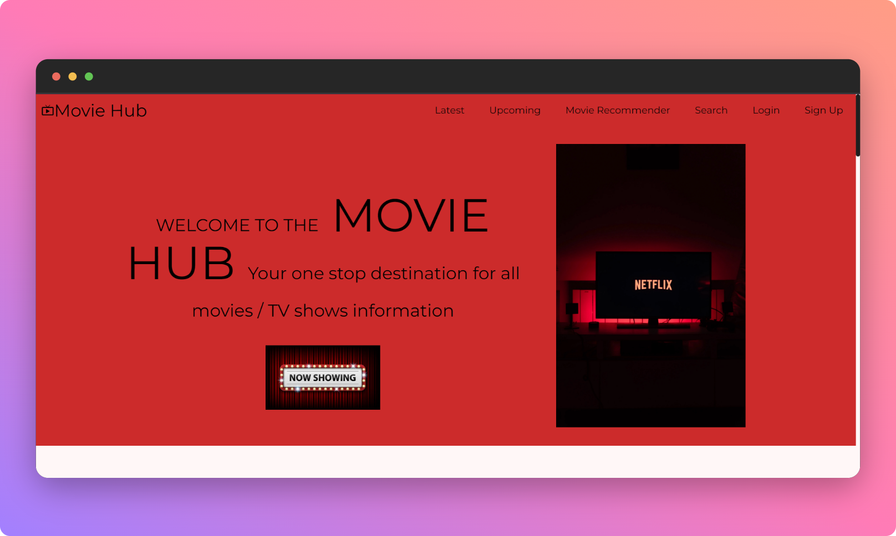
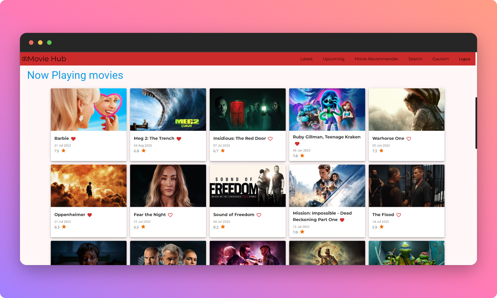
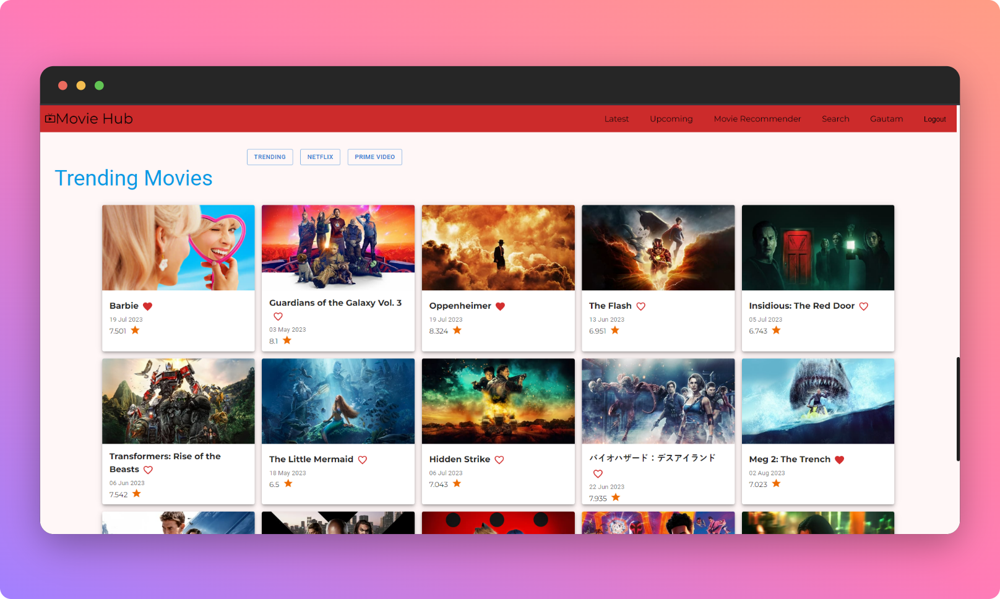
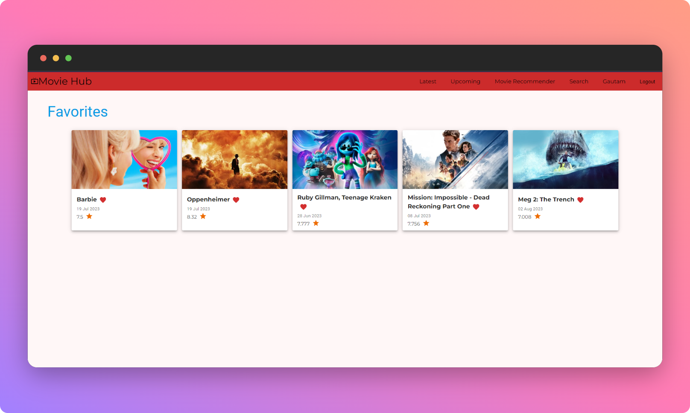
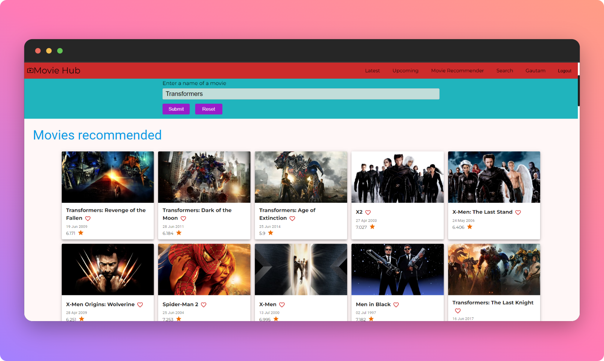
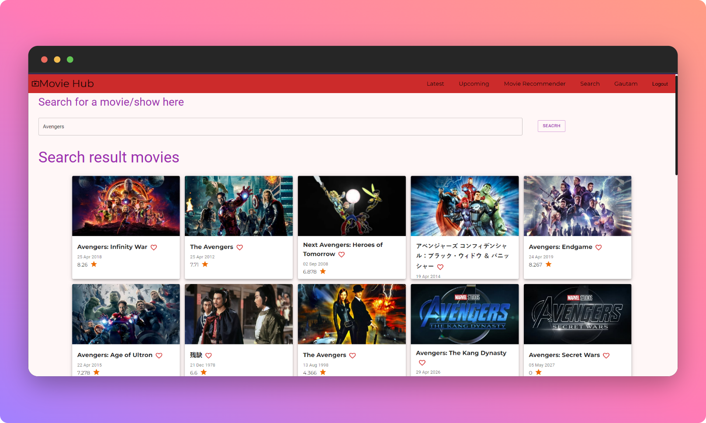

# MovieHub 🎥

#### Link - [https://moviehub-1.netlify.app/](https://moviehub-1.netlify.app/)



MovieHub is a one stop destination for all movies / TV shows information. This project is built using MERN stack. 
##### Motivation 
My motivation to build this project was to build a near real world application and in the process  enhance my knowledge of the MERN stack.
### Technologies used
- [MongoDB](https://www.mongodb.com/atlas/database) -> Database
- [Express](https://expressjs.com/) -> Web framework for Node.js
- [ReactJs](https://react.dev/) -> Frontend framework
- [NodeJs](https://nodejs.org/) -> Backend server
- [Material UI](https://mui.com/) -> Component library
- [Passport](https://passportjs.org/) -> Authentication middleware
- [Bcrypt](https://www.npmjs.com/package/bcrypt) -> Password hashing

### Cloning project
```shell
git clone https://github.com/mgautam07/MovieHub.git
cd MovieHub
```

## Installing backend dependencies
```shell
cd backend
npm install
npm run start
```

## Setup .env file
1. TMDB api key
2. MongoDB URL

## Installing frontend dependencies
```shell
cd frontend
npm install
npm run start
```

## Features
1. Latest movies

2. Movies trending on various platforms

3. User Authentication

4. Favorites

5. Recommendations

6. Search
